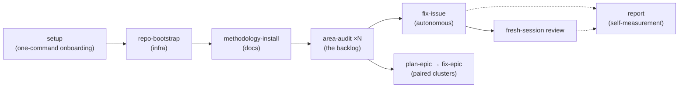

# Agent Ready

> A methodology, packaged as two Claude Code plugins, for handing real work on an existing codebase to AI agents without losing sleep: audit first, automate only the parts the audit proved tractable, and keep a person holding the reins.

Most attempts to put an AI agent on an existing codebase pick one of two ways to lose. You can pair with the agent and watch every keystroke, which gives you trust but no leverage, because now you are doing the work twice. Or you can point the agent at the repo and hope, which gives you leverage but no trust, because you find out what it changed when something breaks. Agent Ready is my attempt at a third way. Audit the codebase first to find the work that is genuinely safe to automate, deploy autonomy only there, and write the instructions tight enough that the agent's only job is to carry out a specification you already verified.

I built the first version of this auditing one of my own projects, [Panama In Context](/projects/panama-in-context), a real deployed site that had drifted into the state every side project eventually reaches: it worked, it paid for itself, and I was scared to touch it. The methodology took it from that stalled place to 138 issues filed and closed, 165 pull requests merged, and zero breakages of `main`. Then I asked a harder question, the one this write-up is really about: what would it take to do this not for one repo and one developer, but for a whole team? Answering that taught me four things the solo version was missing, and I folded all four back into the tool. This is the story of both.

The repository is public and MIT licensed: [github.com/wanderindev/agent-ready](https://github.com/wanderindev/agent-ready).

## The surprise that reorganized the whole thing

I went in expecting the win to be autonomy. Agents writing code while I slept. That happened, and it was the least interesting part.

The real win was clarity. A codebase you are afraid of is not usually a codebase full of hard problems. It is a codebase full of small, unlabeled uncertainty: which of these two patterns is the real one, is this error path load-bearing or dead, did anyone ever finish that migration. The audit's job turned out to be converting that fog into a backlog of specific, classified issues. Once the fog was a list, the stop-start "where do I even begin" problem that quietly kills side projects was gone, and every session started productive. Autonomy was a way to burn down the list faster. The list was the product.

That reframing is why the methodology leads with an audit instead of with an agent, and why the single most important artifact it produces is not a merged PR but a well-written brief.

## What it actually is

Agent Ready is a Claude Code plugin marketplace shipping two plugins and nine skills. The skills walk a project through four phases:

1. **Bootstrap** the repository for agent work: branch protection, CI, issue labels, issue templates.
2. **Install** the methodology's own documentation into the project's tree, so the conventions travel with the code.
3. **Audit** the codebase area by area, filing a labeled, agent-classified backlog.
4. **Resolve** those issues, autonomously where the audit proved the work tractable, in human-paired mode where judgment carries the weight.

Wrapping that pipeline are the four things the team question forced me to build: a committed safety floor, an independent review of every agent's output, telemetry so the methodology measures itself, and a one-command install so the whole setup is a default rather than a personal ritual. Those four are the middle of this write-up, one page each.

## The shape of the pipeline

`fix-issue` is the autonomous path for the subset the audit certified as tractable. `plan-epic` and `fix-epic` are the paired path for clustered work where a human should stay in the loop. Everything downstream of the audit exists to make one of those two paths safe to run.

## The stack, such as it is

There is almost no runtime here. Agent Ready is not an application. It is a set of instructions and a handful of shell scripts that a coding agent reads and executes against your repository.

| Layer | What it is |
|-------|-----------|
| **Distribution** | A Claude Code plugin marketplace: two plugins (`agent-ready`, `agent-ready-guardrails`), auto-discovered skills |
| **Skills** | Nine Markdown skill definitions that drive audit, resolve, guardrails, measurement, and onboarding |
| **Enforcement** | A deny/ask/allow permission policy, a `PreToolUse` guard hook, and non-skippable gates inside the skills |
| **Tooling** | Small `bash` + `jq` scripts using `git` and the GitHub CLI (`gh`); no service, no database, no network beyond your repo |
| **Telemetry** | A local, git-ignored JSONL event log the resolve loop emits, read back by a report script that also derives from `gh`/`git` |

The bias throughout is toward gates rather than guidelines. Anywhere the methodology depends on a discipline and a skill is running at the moment that discipline applies, I would rather wire a structural gate than write a sentence in a document nobody rereads under pressure. Most of what follows is a variation on that idea.

## Table of contents

Each page stands alone, but this is the order I would read them in.

1. **[Auditing a codebase you can't trust yet](01-auditing-a-codebase-you-cant-trust-yet.md)**: the audit-to-autonomy method, why the brief is the load-bearing variable, and why the backlog was the real product.
2. **[A safety floor you commit, not remember](02-a-safety-floor-you-commit-not-remember.md)**: guardrails as policy: deny is catastrophic-only, ask is the production door, and why the floor has to ship centrally.
3. **[You can't review your own work](03-you-cant-review-your-own-work.md)**: the fresh-session review, and the rubber-stamp problem that scaling AI-assisted output creates.
4. **[Adoption measures itself](04-adoption-measures-itself.md)**: instrument the workflow instead of surveying people, store only what you cannot derive, and let the retrospective compute itself.
5. **[Make the good path the default](05-make-the-good-path-the-default.md)**: gates over guidelines, one-command onboarding, and why buying everyone a license is the wrong place to stop.
6. **[What I'd carry forward](06-what-id-carry-forward.md)**: the honest caveats, what is still unproven, and what a solo methodology and a team program taught each other.

---

*This describes Agent Ready as of July 2026. The methodology is version 1: promising, and calibrated to one codebase, one operator, and one model family. The next repositories are the test plan, not the confirmation.*
